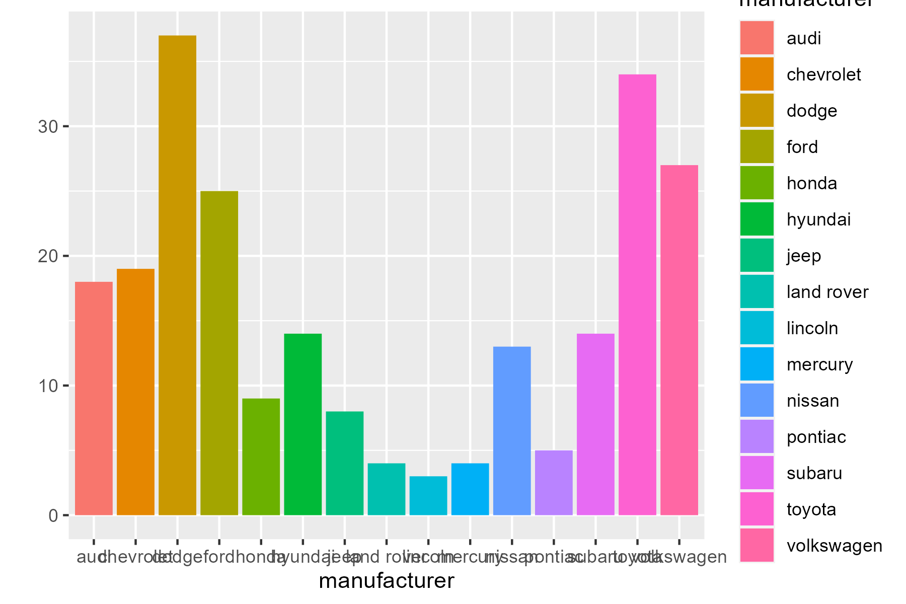
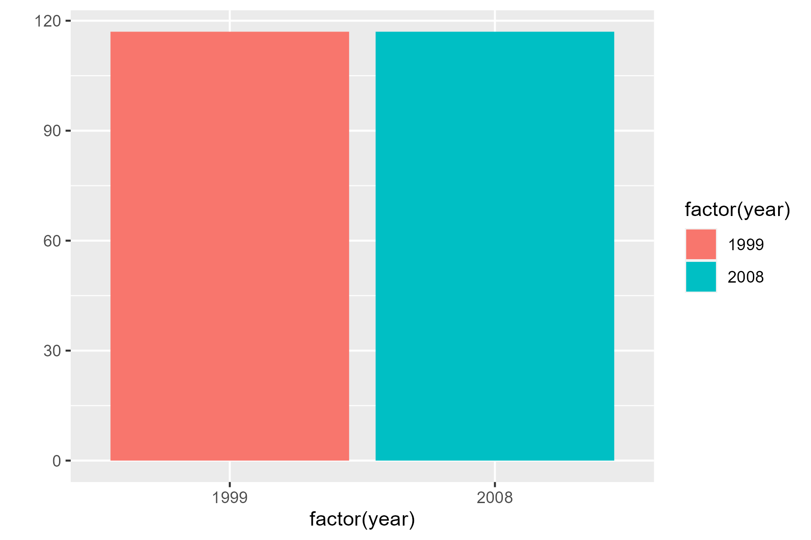
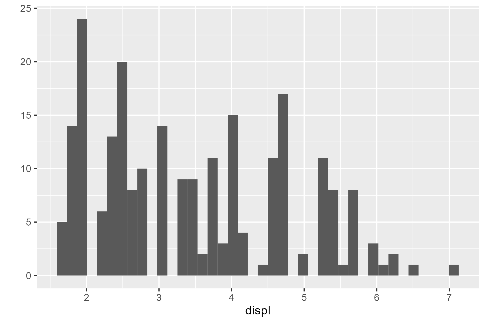
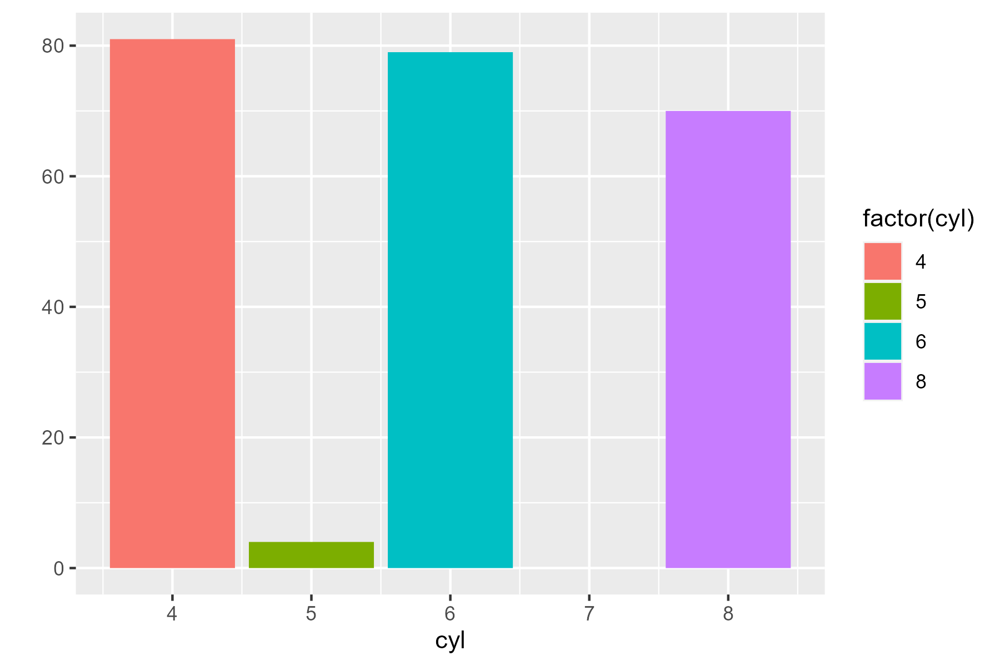
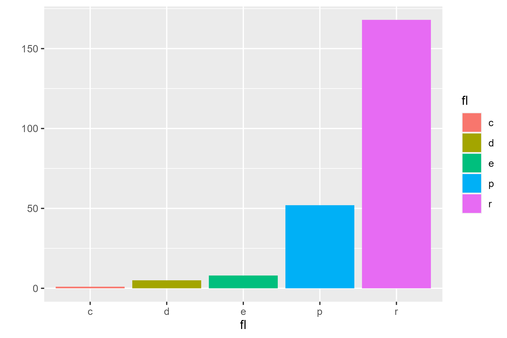

# Data-Exploration-and-Data-Viz-using-qplot
#Exploration of  mpg dataset and visualization using quick qplot
##Quick  and simple visualization using qplot

**By  Promise  Onyemaechi**
```
library("tidyverse") #always run this line at starting R
mpg
#This dataset provides fuel economy data from 1999 and 2008 for 38 popular models of cars. The dataset is shipped

#Data Description
str(mpg) #structure

#Number of rows or observations or records
nrow(mpg)

#Number of columns or variables
ncol(mpg)

#Names of columns
colnames(mpg)

#exploring each variable in the mpg dataset
#MANUFACTURES
table(mpg$manufacturer)

#making quick plot with gplot
m=qplot(manufacturer, data=mpg, geom="bar", fill=manufacturer)
ggsave("manufacture.png", plot = m, width = 6, height = 4)
````
**Plot of Manufacters**


```
# YEAR OF MANUFACTURING
table(mpg$year)
y = qplot(factor(year), data=mpg, geom="bar", fill=factor(year))
ggsave("year.png", plot = y, width = 6, height = 4)
````
**Graph of Year  of Manufacturing**


```
#DISPLAEMENT
#table(mpg$displ)
summary(mpg$displ)
d=qplot(displ, data=mpg, geom="histogram", bins=40)
ggsave("Displacement.png", plot = d, width = 6, height = 4)
```
**Graph of Displacement**


```
table(mpg$cyl)
c=qplot(cyl, data=mpg, geom="bar", fill=factor(cyl))
ggsave("cylinderg", plot = c, width = 6, height = 4)
```
**Graph of Number of Cylinders**


```
#Fuel types
table(mpg$fl)
f=qplot(fl, data=mpg, geom="bar", fill=fl)
ggsave("fuel_type.png", plot = f, width = 6, height = 4)
```
**Graph  of  Fuel type**



